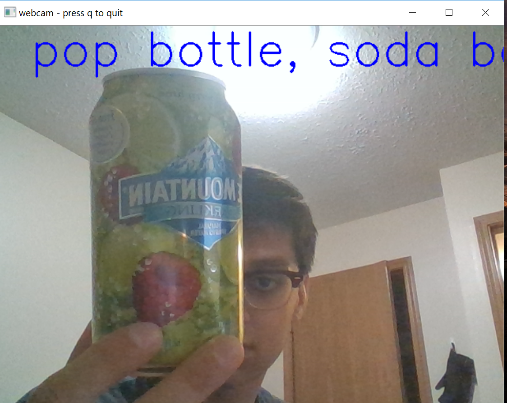
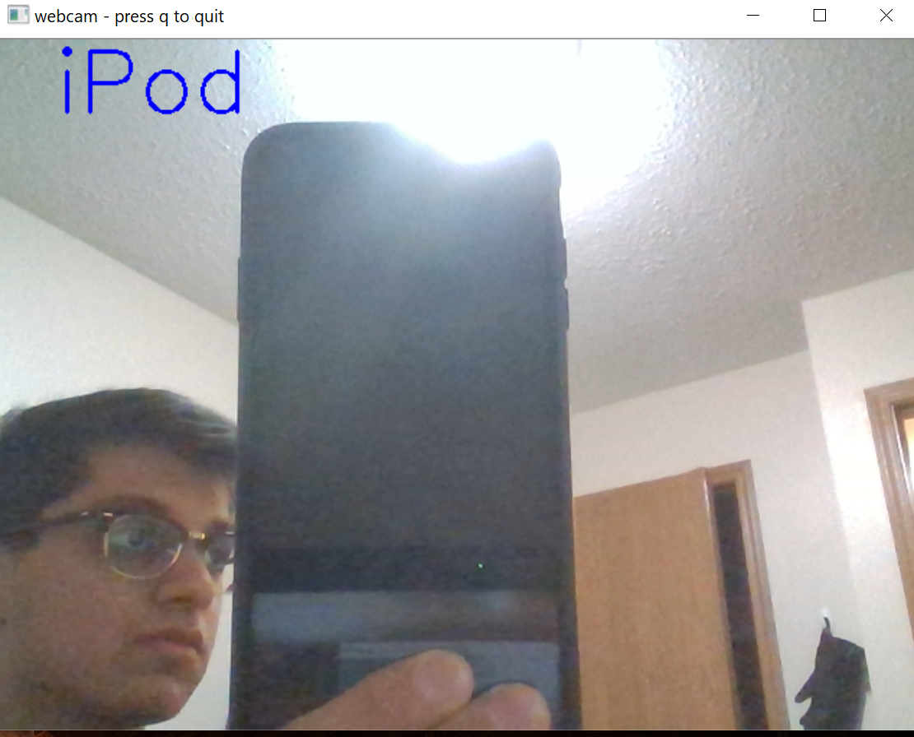

This took me a while to do mostly because of how long it took to unzip the dataset (tiny-imagenet-200) and how large the network is (for my measly Intel iGPU). Even just training the last layer took my laptop half an hour to get through one-third of an epoch.

After ending training there, I saved the model and tested it against the validation set. I’m seeing about 40% accuracy which is extremely good especially for only getting through a third of an epoch and shows how powerful transfer learning can be.

I have already provided a trained model in the folder `saved_models`. To train/save another model run `train.py` using the following structure:

`python3 train.py --data /tiny/imagenet/dir/ --save /dir/to/save/model/`

To test the created model from the above, run `test.py` like so:

`python3 test.py --model /dir/containing/model/--data /tiny/imagenet/dir/`

If you don’t specify the data directory, it defaults to `./data/tiny-imagenet-200`and if you don’t specify the model directory, it defaults to `./saved_models`.

We can see the results of the model in real life when I pass my webcam output to it:

It is much faster and more reliable than LeNet-5 which I trained previously on CIFAR-100 instead. It would be interesting to test Alexnet(current net) vs LeNet-5 when they’re both trained on tiny-imagenet-200.